# PowerConnect

**Pardus tabanlı açık kaynaklı sınıf yönetim aracı**

[](https://www.gnu.org/licenses/gpl-3.0)
[](https://python.org)
[](https://pardus.org.tr)
[](https://github.com/yigitatmaca42/PowerConnect/releases/latest)

PowerConnect, öğretmenin ekranını öğrenci bilgisayarlarına gerçek zamanlı olarak yayınlamasını, dosya göndermesini ve öğrenci dosya sistemine erişmesini sağlayan hafif ve kurulumu kolay bir uygulamadır. Tamamen Pardus Linux üzerinde geliştirilmiş olup yerli ve milli ekosisteme katkı sağlamayı hedeflemektedir.

---

## Kurulum

### Öğretmen PC

```bash
# 1. Paketi indir
wget https://github.com/yigitatmaca42/PowerConnect/releases/latest/download/powerconnect_amd64.deb

# 2. Kur
sudo dpkg -i powerconnect_amd64.deb
```

Kurulum tamamlandıktan sonra uygulamayı başlatmak için:

```bash
PowerConnect
```

### Öğrenci PC'ler

```bash
# 1. Paketi indir
wget https://github.com/yigitatmaca42/PowerConnect/releases/latest/download/powerconnect-client_amd64.deb

# 2. Kur
sudo dpkg -i powerconnect-client_amd64.deb
```

Kurulum tamamlandıktan sonra servis otomatik olarak başlar. Bilgisayar her açıldığında arka planda çalışır, başka bir işlem gerekmez.

> Öğrenci servisi `/opt/powerconnect/user` konumuna kurulur ve kilitlenir. `rm -rf` ile bile silinemez, yalnızca format atılarak kaldırılabilir.

Tüm sürümler için → [Releases](https://github.com/yigitatmaca42/PowerConnect/releases)

---

## Özellikler

- **Otomatik Keşif** — Aynı ağdaki öğrenci PC'ler UDP broadcast ile otomatik bulunur, IP girişi gerekmez
- **Gerçek Zamanlı Ekran Yayını** — Öğretmen ekranı 30 FPS ile öğrencilere iletilir
- **Öğrenci Kilidi** — Yayın sırasında öğrenci klavye/fare kullanamaz, pencereyi kapatamaz
- **Çoklu Bağlantı** — Aynı anda birden fazla öğrenci PC'ye bağlanılabilir
- **Toplu İşlem** — Hepsine Bağlan / Hepsini Geri Sal
- **PC Arama** — PC adı veya IP'ye göre anlık filtreleme
- **Dosya Gönderme** — Seçili PC'lere dosya gönderilebilir, otomatik masaüstüne kaydedilir
- **Uzak Dosya Gezgini** — Öğrenci dosya sistemi görüntülenebilir, dosya ve klasörler indirilebilir
- **Silinmez Kurulum** — `chattr +i` ile kilitli, format dışında silinemez
- **Otomatik Başlatma** — Systemd user servisi olarak her açılışta çalışır

---

## Kullanım

### Bağlantı

Uygulama açıldığında aynı ağdaki tüm öğrenci PC'ler otomatik olarak panelde listelenir. İstediğiniz PC'lere tek tek veya toplu olarak bağlanabilirsiniz.

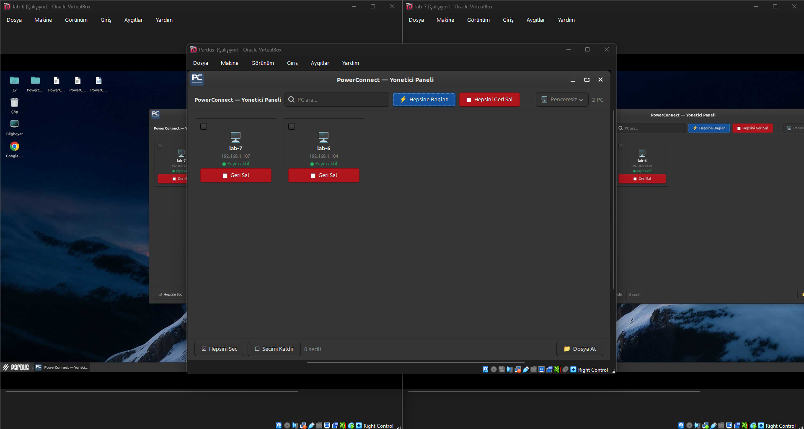

Birden fazla PC'ye bağlı kalırken istediğiniz PC'leri bağlı tutup diğerlerini serbest bırakabilirsiniz.

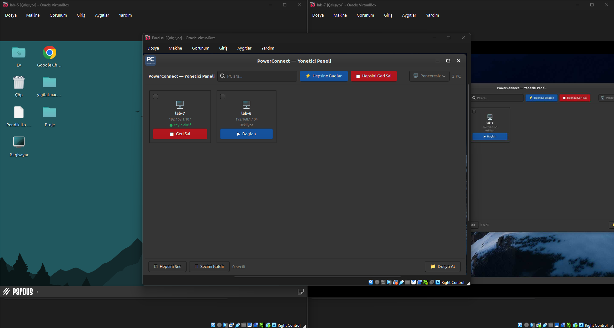

### PC Arama ve Filtreleme

Çok sayıda PC olduğunda arama çubuğuna yazdığınız ifadeyle listeyi daraltabilirsiniz. Örneğin "lab6" yazınca yalnızca adında "lab6" geçen PC'ler görünür. "Hepsine Bağlan" butonu yalnızca filtredeki PC'lere bağlanır, diğerlerine dokunmaz.

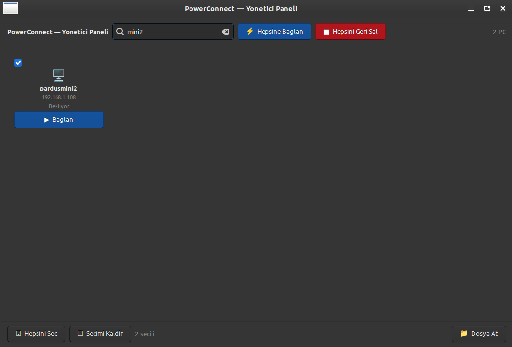

### Uzak Dosya Gezgini

Herhangi bir PC kartına sağ tıklayarak o bilgisayarın dosyalarına göz atabilirsiniz.

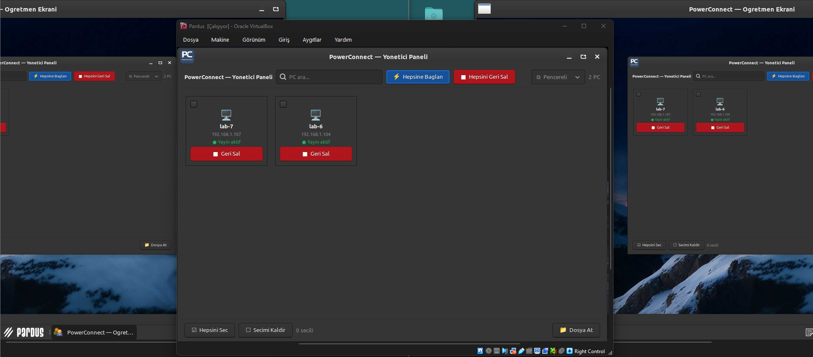

Gezgin otomatik olarak öğrencinin home dizinini açar. Sol ok tuşuna basarak üst dizine çıkabilir, "/" kök dizininden istediğiniz klasöre ulaşabilirsiniz.

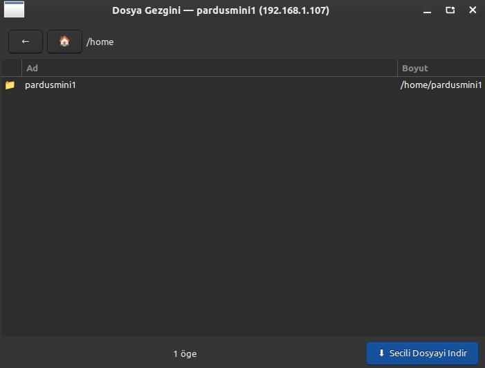

Öğrenci PC'nin tüm klasör yapısını kendi bilgisayarınızdaki gibi gezebilirsiniz.

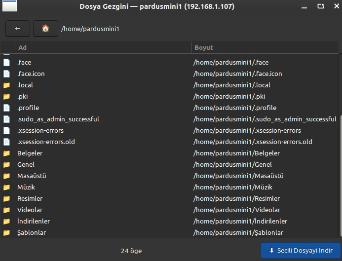

Masaüstüne geldiğinizde masaüstündeki tüm dosya ve klasörler listelenir.

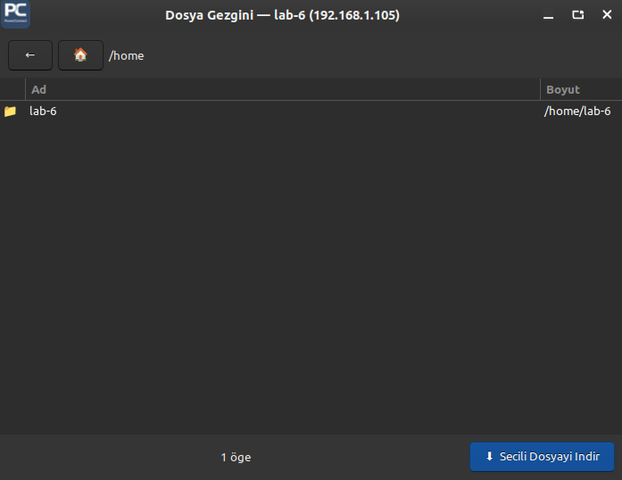

### Dosya İndirme

İstediğiniz dosyayı seçip "Seçili Dosyayı İndir" butonuna basarak kendi bilgisayarınıza çekebilirsiniz.

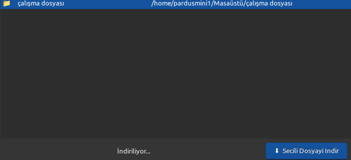

İndirme tamamlandığında hangi dosyanın masaüstüne indirildiği altta gösterilir.

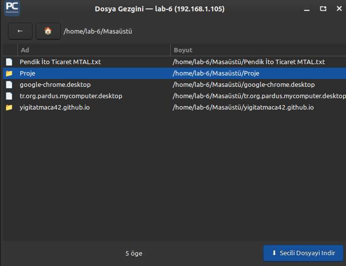

### Dosya Gönderme

Dosya göndermek istediğiniz PC'leri seçmek için her PC kartının sol üst köşesindeki kutucuğa tıklayabilir ya da alttaki "Hepsini Seç" butonunu kullanabilirsiniz.

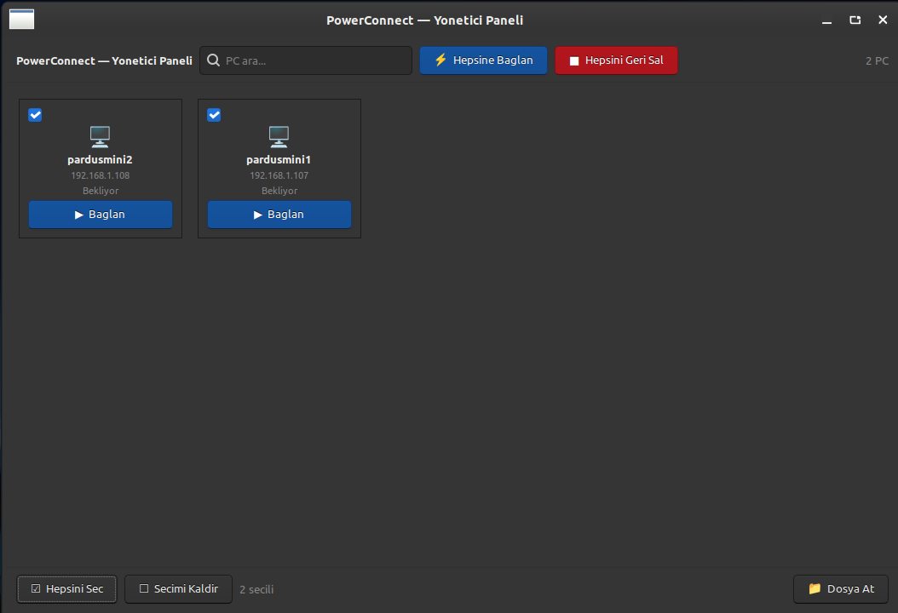

PC'leri seçtikten sonra "Dosya At" butonuna basınca dosya seçici açılır.

> **Not:** Klasör göndermek için önce zip/rar olarak sıkıştırmanız gerekmektedir.


"Gönder" butonuna basıldığında uygulama kaç PC'ye gönderildiğini altta gösterir.


Dosya sırayla tüm seçili PC'lere gönderilir, en son hangi PC'ye ulaştığı anlık olarak güncellenir.

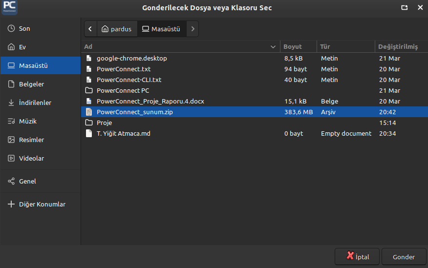

Gönderilen dosya öğrenci PC'sinin masaüstüne sorunsuz şekilde düşer.

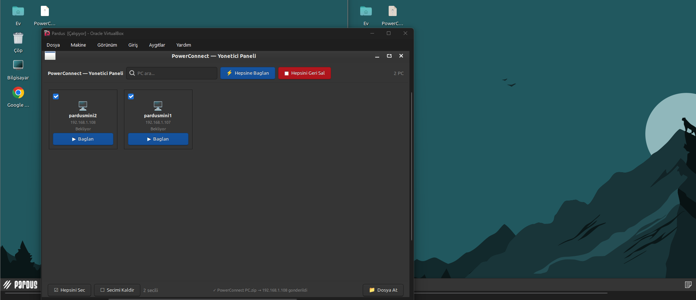

---

## Mimari

```
PowerConnect/
├── src/            # Kaynak kodlar
│   ├── host.py     # Öğretmen uygulaması
│   └── user.py     # Öğrenci servisi
├── bin/            # Derlenmiş ELF dosyaları
│   ├── PowerConnect
│   └── user
├── releases/       # Kurulum paketleri (.deb)
│   ├── powerconnect_amd64.deb
│   └── powerconnect-client_amd64.deb
└── screenshots/    # Ekran görüntüleri
```

### Ağ Protokolü

| Port | Protokol | İşlev |
|---|---|---|
| 5559 | UDP Broadcast | Öğrenci keşif mesajları |
| 5558 | TCP | Ekran yayını |
| 5557 | TCP | Dosya gönderme |
| 5556 | TCP | Uzak dosya gezgini |

---

## Kaynak Koddan Derleme

```bash
pip3 install pyinstaller mss Pillow --break-system-packages

# Öğretmen uygulaması
pyinstaller --onefile src/host.py -n PowerConnect

# Öğrenci uygulaması
pyinstaller --onefile src/user.py -n user
```

---

## Katkıda Bulunma

1. Bu repoyu fork edin
2. Feature branch oluşturun (`git checkout -b ozellik/yeni-ozellik`)
3. Değişikliklerinizi commit edin (`git commit -m 'feat: yeni özellik ekle'`)
4. Branch'i push edin (`git push origin ozellik/yeni-ozellik`)
5. Pull Request açın

---

## Lisans

Bu proje GNU General Public License v3.0 ile lisanslanmıştır — bkz. [LICENSE](LICENSE)

## İletişim

Geliştirici: Taha Yiğit Atmaca
GitHub: [@yigitatmaca42](https://github.com/yigitatmaca42)
