# PowerConnect

**Pardus tabanlı açık kaynaklı sınıf yönetim aracı**

[](https://www.gnu.org/licenses/gpl-3.0)
[](https://python.org)
[](https://pardus.org.tr)
[](https://github.com/yigitatmaca42/PowerConnect/releases/latest)

PowerConnect, öğretmenin ekranını öğrenci bilgisayarlarına gerçek zamanlı olarak yayınlamasını, dosya göndermesini ve öğrenci dosya sistemine erişmesini sağlayan hafif ve kurulumu kolay bir uygulamadır. Tamamen Pardus Linux üzerinde geliştirilmiş olup yerli ve milli ekosisteme katkı sağlamayı hedeflemektedir.

---

## Kurulum

### Öğretmen PC

```bash
# 1. Paketi indir
wget https://github.com/yigitatmaca42/PowerConnect/releases/download/v1.0.6/powerconnect_1.0.6_amd64.deb

# 2. Kur
sudo dpkg -i powerconnect_1.0.6_amd64.deb
```

Kurulum tamamlandıktan sonra uygulamayı başlatmak için:

```bash
PowerConnect
```

### Öğrenci PC'ler

```bash
# 1. Paketi indir
wget https://github.com/yigitatmaca42/PowerConnect/releases/download/v1.0.6/powerconnect-client_1.0.6_amd64.deb

# 2. Kur
sudo dpkg -i powerconnect-client_1.0.6_amd64.deb
sudo apt install -f -y
```

Kurulum tamamlandıktan sonra servis otomatik olarak başlar. Bilgisayar her açıldığında arka planda çalışır, başka bir işlem gerekmez.

> Öğrenci servisi `/opt/powerconnect/user` konumuna kurulur ve kilitlenir. `rm -rf` ile bile silinemez, yalnızca format atılarak kaldırılabilir.

Tüm sürümler için → [Releases](https://github.com/yigitatmaca42/PowerConnect/releases)

---

## Özellikler

- **Otomatik Keşif** — Aynı ağdaki öğrenci PC'ler UDP broadcast ile otomatik bulunur, IP girişi gerekmez
- **Canlı Ekran Önizleme** — Her öğrenci PC kartında ekran canlı olarak görüntülenir
- **Gerçek Zamanlı Ekran Yayını** — Öğretmen ekranı 25 FPS ile öğrencilere iletilir
- **Öğrenci Ekranı İzleme ve Kontrolü** — PC kartındaki küçük önizlemeye tıklanarak öğrenci ekranı büyük pencerede açılır; fare, klavye ve scroll öğrenci bilgisayarına iletilir
- **Pencereli / Penceresiz Mod** — Penceresiz modda tam ekran ve öğrenci kilidi, pencereli modda alt+tab serbestliği
- **Öğrenci Kilidi** — Penceresiz modda öğrenci klavye/fare kullanamaz, pencereyi kapatamaz
- **Çoklu Bağlantı** — Aynı anda birden fazla öğrenci PC'ye bağlanılabilir
- **Toplu İşlem** — Hepsine Bağlan / Hepsini Geri Sal
- **PC Arama** — PC adı veya IP'ye göre anlık filtreleme; filtreye toplu bağlanma
- **Dosya Gönderme** — Seçili PC'lere dosya gönderilebilir, otomatik masaüstüne kaydedilir
- **Uzak Dosya Gezgini** — Öğrenci dosya sistemi görüntülenebilir, dosya ve klasörler indirilebilir
- **Otomatik Ağ Bağlantısı** — Açılışta ağ yoksa nmcli/dhcpcd/dhclient sırayla denenir, otomatik IP alınır
- **Kopuk PC Tespiti** — 5 saniye broadcast gelmezse PC panelden otomatik kaldırılır
- **Self-loop Koruması** — Yönetici PC'de client kuruluysa kendi kendini listede göstermez
- **Silinmez Kurulum** — `chattr +i` ile kilitli, format dışında silinemez
- **Otomatik Başlatma** — Systemd user servisi olarak her açılışta çalışır

---

## Kullanım

### Bağlantı

Uygulama açıldığında aynı ağdaki tüm öğrenci PC'ler otomatik olarak panelde listelenir. Her PC kartında öğrencinin ekranı canlı olarak görüntülenir. "Hepsine Bağlan" butonuyla tüm PC'lere aynı anda, "Bağlan" butonuyla tek tek bağlanılabilir.

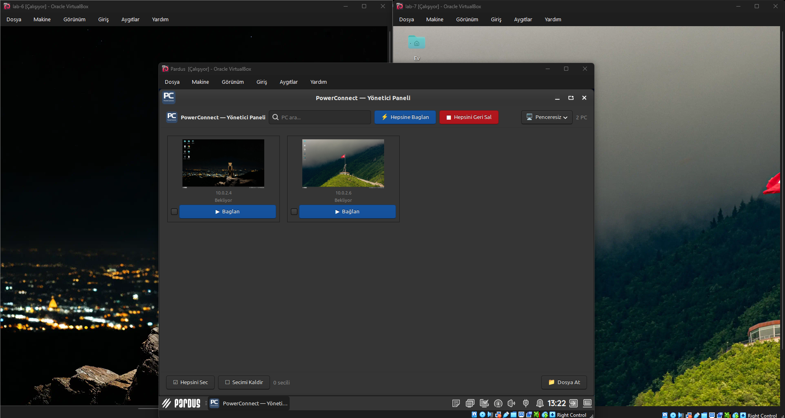

Tek tek de istediğiniz PC'ye manuel olarak bağlanabilirsiniz.

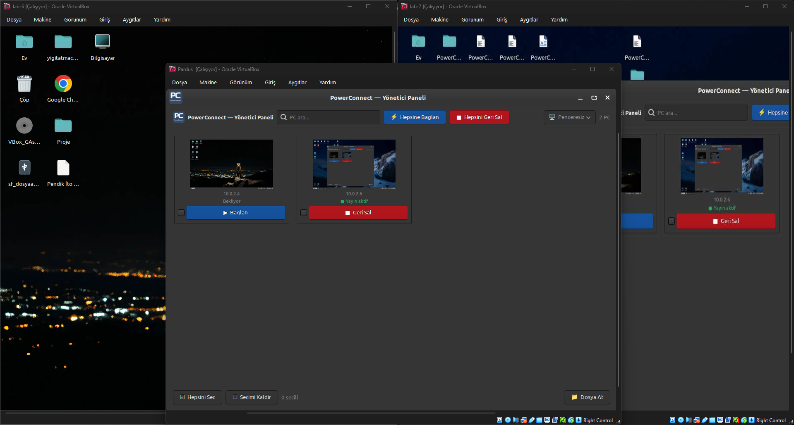

Tüm PC'lere aynı anda bağlanıldığında kartlar "Yayın aktif" durumuyla güncellenir.

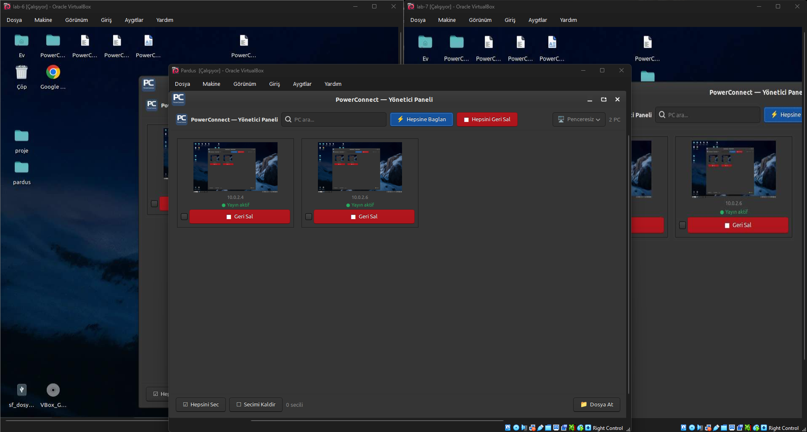

### Ekran Modu

Bağlanmadan önce sağ üstteki dropdown'dan ekran modunu seçebilirsiniz. Bağlantı kurulduktan sonra mod seçimi kilitlenir, tüm bağlantılar kesilene kadar değiştirilemez.

- **Penceresiz** — Öğrenci ekranı tam ekran alınır, klavye/fare engellenir
- **Pencereli** — Öğrenci alt+tab atabilir, ekranı küçültebilir ama kapatamaz

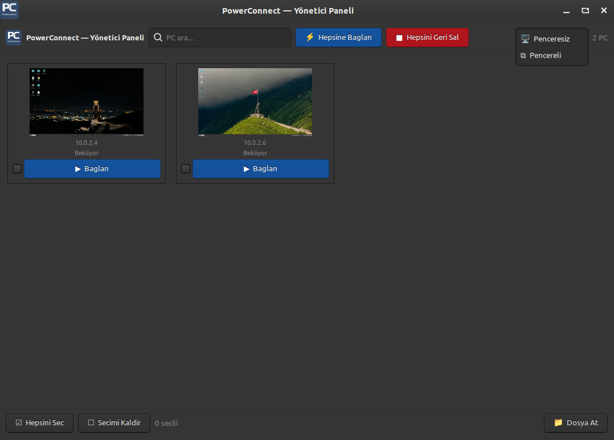

Pencereli modda öğrenci pencereyi kapatamaz, sadece taşıyabilir veya küçültebilir.

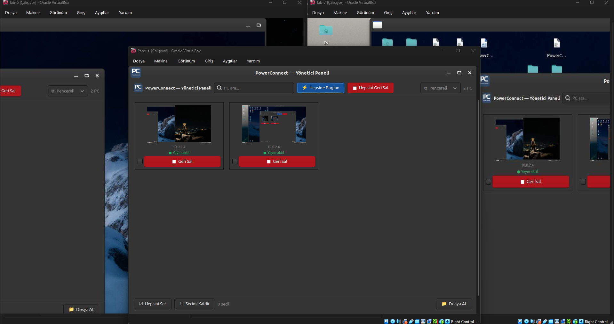

### PC Arama ve Filtreleme

Arama çubuğuna yazdığınız ifadeyle listeyi daraltabilirsiniz. "Hepsine Bağlan" butonu yalnızca filtredeki PC'lere bağlanır.

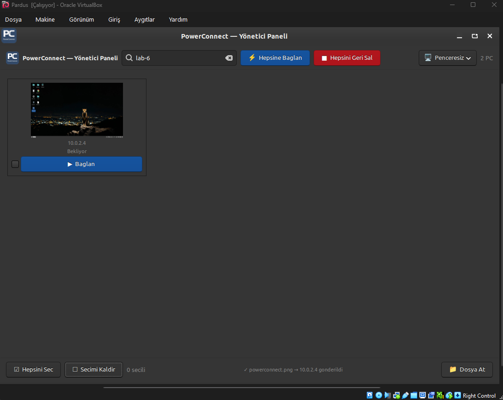

### Öğrenci Ekranı İzleme ve Kontrolü

Herhangi bir PC kartına sağ tıklayarak "Büyük Ekranda İzle + Kontrol Et" seçeneğine tıklanır. Aynı işlem PC kartındaki küçük önizlemeye tıklanarak da yapılabilir.

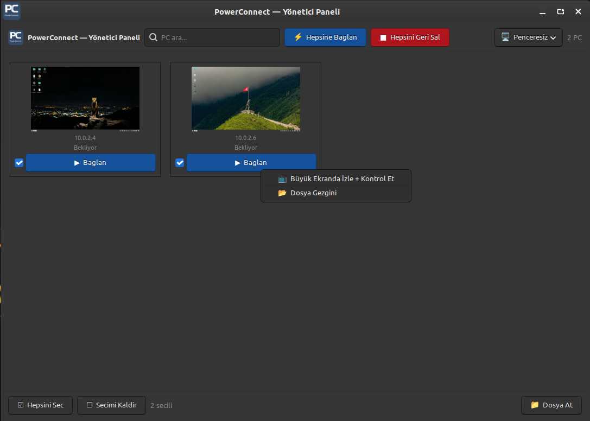

Öğrencinin ekranı büyük pencerede açılır ve kontrol moduna geçilir. Fare hareketleri, tıklamalar, klavye girdileri ve kaydırma (scroll) gerçek zamanlı olarak öğrenci bilgisayarına iletilir. Öğrenci ekranı, yönetici penceresi küçültülse bile her zaman kendi monitörünün tam çözünürlüğünde görüntülenir.

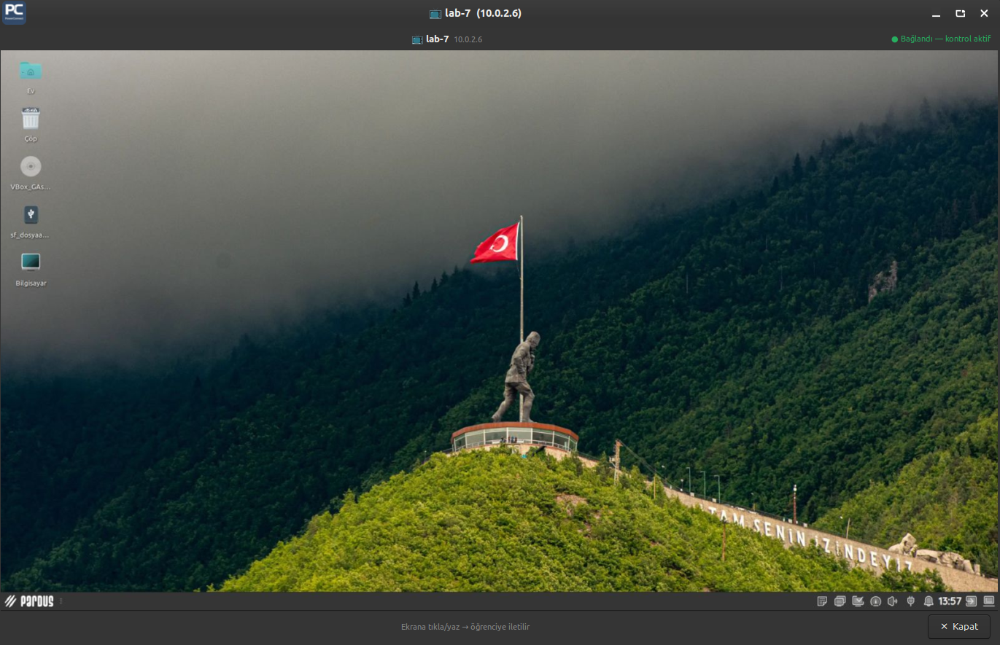

### Uzak Dosya Gezgini

Herhangi bir PC kartına sağ tıklayarak o bilgisayarın dosyalarına göz atabilirsiniz.

Gezgin otomatik olarak öğrencinin home dizinini açar. Sol ok ile üst dizine, ev ikonu ile home'a dönülebilir.

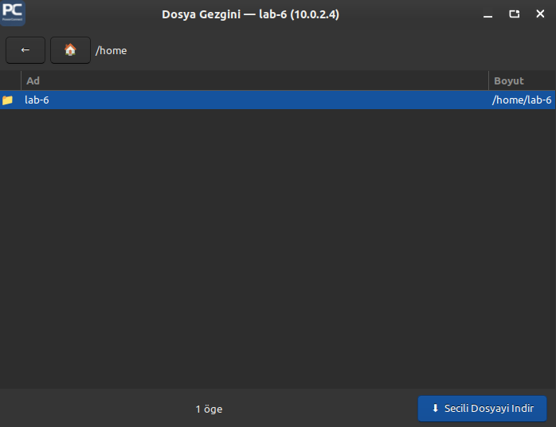

Öğrenci PC'nin tüm klasör yapısını gezebilirsiniz.

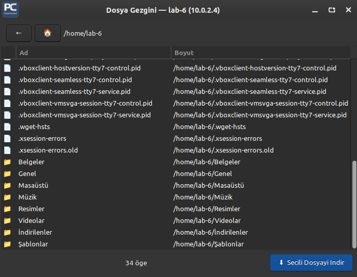

Masaüstündeki dosya ve klasörler listelenir, toplam öge sayısı altta gösterilir.

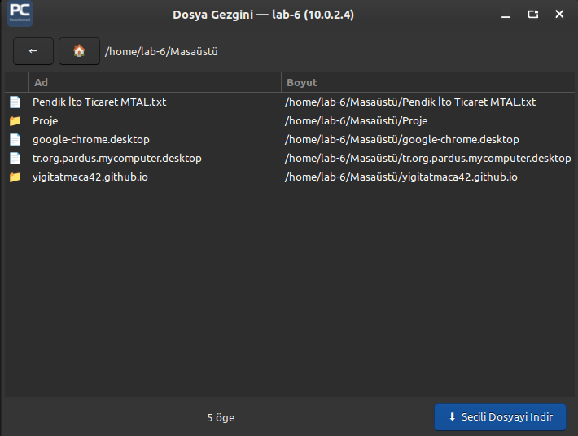

### Dosya İndirme

Bir ögeyi seçip "Seçili Dosyayı İndir" butonuyla kendi bilgisayarınıza indirebilirsiniz.


İndirme tamamlandığında dosya adıyla birlikte bildirim gösterilir.


### Dosya Gönderme

"Hepsini Seç" ile tüm PC'leri, kutucuğa tıklayarak tek tek seçebilirsiniz. Seçili PC sayısı butonların yanında gösterilir.


"Dosya At" butonuna basınca kendi bilgisayarınızın dosya yöneticisi açılır.

> **Not:** Klasör göndermek için önce zip/rar olarak sıkıştırmanız gerekmektedir.

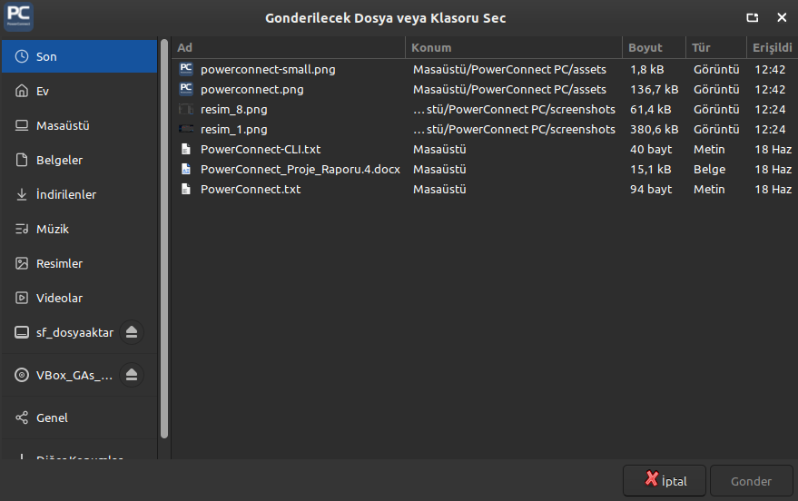

Gönderim başladığında hangi PC'ye gönderildiği anlık olarak güncellenir.

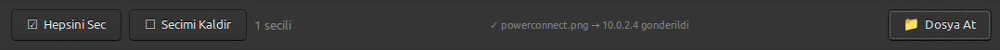

Gönderilen dosya tüm öğrenci PC'lerin masaüstüne sorunsuz düşer.

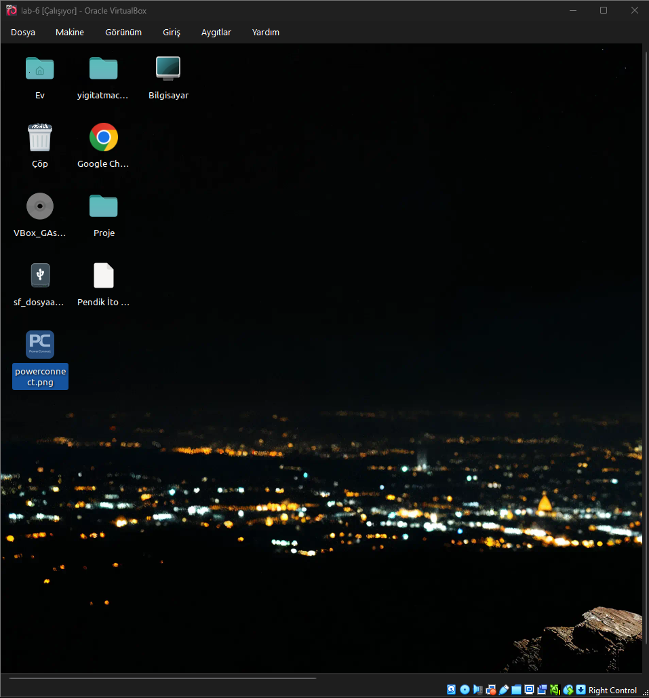

---

## Mimari

```
PowerConnect/
├── src/                  # Kaynak kodlar
│   ├── host.py           # Öğretmen uygulaması
│   └── user.py           # Öğrenci servisi
├── bin/                  # Derlenmiş ELF dosyaları
│   ├── PowerConnect
│   └── PowerConnect-Client
├── releases/             # Kurulum paketleri (.deb)
│   ├── powerconnect_1.0.6_amd64.deb
│   └── powerconnect-client_1.0.6_amd64.deb
├── assets/               # Logo ve ikonlar
│   ├── powerconnect.png       (626x626)
│   └── powerconnect-small.png (32x32)
└── screenshots/          # Ekran görüntüleri
```

### Ağ Protokolü

| Port | Protokol | İşlev |
|---|---|---|
| 5559 | UDP Broadcast | Öğrenci keşif mesajları |
| 5558 | TCP | Ekran yayını + mod bilgisi |
| 5557 | TCP | Dosya gönderme |
| 5556 | TCP | Uzak dosya gezgini |
| 5555 | TCP | Öğrenci ekranı izleme ve kontrolü |

---

## Kaynak Koddan Derleme

```bash
pip3 install pyinstaller mss Pillow --break-system-packages

# Öğretmen uygulaması
pyinstaller --onefile \
  --add-data "assets/powerconnect.png:assets" \
  --add-data "assets/powerconnect-small.png:assets" \
  src/host.py -n PowerConnect

# Öğrenci uygulaması
pyinstaller --onefile \
  --add-data "assets/powerconnect.png:assets" \
  --add-data "assets/powerconnect-small.png:assets" \
  src/user.py -n PowerConnect-Client
```

---

## Katkıda Bulunma

1. Bu repoyu fork edin
2. Feature branch oluşturun (`git checkout -b ozellik/yeni-ozellik`)
3. Değişikliklerinizi commit edin (`git commit -m 'feat: yeni özellik ekle'`)
4. Branch'i push edin (`git push origin ozellik/yeni-ozellik`)
5. Pull Request açın

---

## İletişim

Geliştirici: Taha Yiğit Atmaca
GitHub: [@yigitatmaca42](https://github.com/yigitatmaca42)
E-posta: powerconnectofficial2026@gmail.com

---

## Lisans

Bu proje GNU General Public License v3.0 ile lisanslanmıştır — bkz. [LICENSE](LICENSE)
